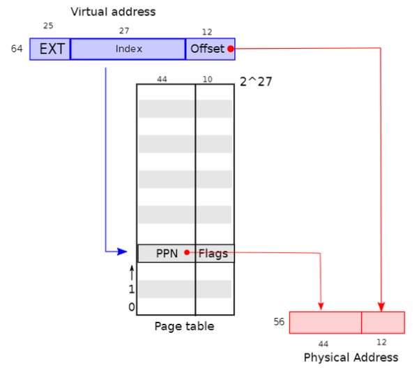
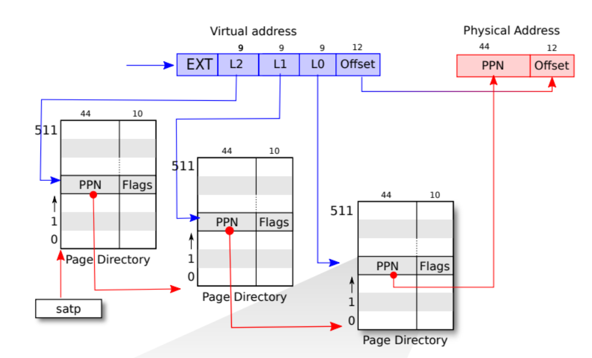

# 1.Print a page table (难度：easy)

- **题目要求**

>定义一个名为`vmprint()`的函数。它应当接收一个`pagetable_t`作为参数，并以下面描述的格式打印该页表。在`exec.c`中的`return argc`之前插入`if(p->pid==1) vmprint(p->pagetable)`，以打印第一个进程的页表。如果你通过了`pte printout`测试的`make grade`，你将获得此作业的满分。

```c++
page table 0x0000000087f6e000
..0: pte 0x0000000021fda801 pa 0x0000000087f6a000
.. ..0: pte 0x0000000021fda401 pa 0x0000000087f69000
.. .. ..0: pte 0x0000000021fdac1f pa 0x0000000087f6b000
.. .. ..1: pte 0x0000000021fda00f pa 0x0000000087f68000
.. .. ..2: pte 0x0000000021fd9c1f pa 0x0000000087f67000
..255: pte 0x0000000021fdb401 pa 0x0000000087f6d000
.. ..511: pte 0x0000000021fdb001 pa 0x0000000087f6c000
.. .. ..510: pte 0x0000000021fdd807 pa 0x0000000087f76000
.. .. ..511: pte 0x0000000020001c0b pa 0x0000000080007000
```

第一行显示`vmprint`的参数。之后的每行对应一个PTE，包含树中指向页表页的PTE。每个PTE行都有一些“`..`”的缩进表明它在树中的深度。每个PTE行显示其在页表页中的PTE索引、PTE比特位以及从PTE提取的物理地址。不要打印无效的PTE。在上面的示例中，顶级页表页具有条目0和255的映射。条目0的下一级只映射了索引0，该索引0的下一级映射了条目0、1和2。

您的代码可能会发出与上面显示的不同的物理地址。条目数和虚拟地址应相同。


- **解题步骤**
- 先来看看虚拟内存如何通过页表转换成物理内存



虚拟内存可以分成三个部分，第一部分低12位是页内偏移量。第二部分13~39位是index位，这个index是一个逻辑地址，他指向的是页表内的第几个页表项`(PTE)`，通过页表项我们可以获得物理地址的高44位`PPN`，这个和页内偏移量结合就是内存中的物理地址。第三部分是EXT暂时没有太大用处



这张图片是一个三级页表的结构，三级页表的结构大大缓解了页表过长而占用很大连续地址空间的缺点，并且可扩展性很强。

这里虚拟地址被分为了五个部分，`L2`，`L1`，`L0`，页内偏移量。后面三个都是逻辑地址，分别指明了一级页表的一个页表项，二级页表的一个页表项，三级页表的一个页表项。一级页表的物理地址存在一个寄存器中可以直接取出，借助`L2`可以获得一个物理地址，也就是二级页表的物理位置。`L1`和二级页表找打一级页表，`L0`和一级页表找到最终的物理地址高位，结合`Offset`获得最终的物理地址

**可以看做一个树，一级页表和二级页表都是非叶子结点，三级页表是叶子结点**


- 阅读`kernel/vm.c`和`kernel/riscv.h`

在`riscv.h`中定义了一些宏定义，方便代码编写

```c++
#define PTE_V (1L << 0) // 该标志位表示页表项是否有效
#define PTE_R (1L << 1) // 该标志位表示页面可读
#define PTE_W (1L << 2) // 该标志位表示页面可写
#define PTE_X (1L << 3) // 该标志位表示页面可执行
#define PTE_U (1L << 4) // 该标志位表示用户级代码是否可以访问页面如果设置了这个标志位，用户级代码可以访问；否则不能访问

#define PTE2PA(pte) (((pte) >> 10) << 12) // 获取页表项中的高位物理地址，也就是把后面的flags(看图)去掉
```


在`vm.c`文件中的`freewalk()`函数帮助理解多级页表的遍历过程

```c++
void
freewalk(pagetable_t pagetable)
{
  // there are 2^9 = 512 PTEs in a page table.
  for(int i = 0; i < 512; i++){
    pte_t pte = pagetable[i];

    // 检查 PTE 是否有效（即 PTE_V 位被设置）
    // 如果 PTE 有效，但它既不是可读、可写，也不是可执行的（即非叶子节点），那么它指向下一级页表。
    if((pte & PTE_V) && (pte & (PTE_R|PTE_W|PTE_X)) == 0){
      // this PTE points to a lower-level page table.
      uint64 child = PTE2PA(pte);
      freewalk((pagetable_t)child);
      pagetable[i] = 0;
    } else if(pte & PTE_V){
      panic("freewalk: leaf");
    }
  }
  kfree((void*)pagetable);
}
```


- 代码编写

```c++
void _vmprint(pagetable_t pt, int deep) {
  for (int i = 0; i < 512; i++) {
    // 页表中的每个pte
    pte_t pte = pt[i];
    // 有效的pte
    if (pte && PTE_V) {
      // 打印深度
      for (int j = 1; j <= deep; j++) {
        printf("..");
        if (j != deep) printf(" ");
      }
      // 非叶子结点(前两级页表)
      if((pte & (PTE_R|PTE_W|PTE_X)) == 0){
        // 打印信息
        pagetable_t pa = (pagetable_t)PTE2PA(pte);
        printf("%d: pte %p pa %p\n", i, pte, pa);
        // 递归
        _vmprint(pa, deep+1);
        // 叶子结点(最后的页表)  
      } else {
        // 打印信息
        pagetable_t pa = (pagetable_t)PTE2PA(pte);
        printf("%d: pte %p pa %p\n", i, pte, pa);
      }
    }
  }
}

void 
vmprint(pagetable_t pt) {
  // 打印参数
  printf("page table %p\n", pt);
  _vmprint(pt, 1);
}
```

- 因为题目要求要打印`vmprint`的参数，为了解决递归过程多次打印参数的问题，需要一个辅助函数来进行递归
- 辅助函数采用了原函数加下划线。下划线表示这个函数是内部使用的，它不应该被外部代码直接调用，而是由模块或库的内部实现使用。这是一种约定，用来提醒开发者不要在模块或类外部直接调用这些函数


# 2.A kernel page table per process (难度：hard)

- **题目要求**

>你的第一项工作是修改内核来让每一个进程在内核中执行时使用它自己的内核页表的副本。修改`struct proc`来为每一个进程维护一个内核页表，修改调度程序使得切换进程时也切换内核页表。对于这个步骤，每个进程的内核页表都应当与现有的的全局内核页表完全一致。如果你的`usertests`程序正确运行了，那么你就通过了这个实验。


- **解题步骤**

我们根据提示一步一步来

- 在`struct proc`中为进程的内核页表增加一个字段

```c++
struct proc {
  struct spinlock lock;
  // ...
  pagetable_t pagetable;       // User page table
  pagetable_t kernel_pt;       // 进程的内核页表
  // ...
};
```

进程拥有内核区和用户区，第一个`pagetable`页表是用户区使用的，而新加入的`kernel_pt`是进程内核区的页表


- 一个新进程生成一个内核页表的合理方案是实现一个修改版的`kvminit`，这个版本中应当创造一个新的页表而不是修改`kernel_pagetable`。你将会考虑在`allocproc`中调用这个函数

提示中让我们修改`kvminit`，我们先观察这个函数

```c++
void
kvminit()
{
  // 内核页表通过 kalloc() 分配
  kernel_pagetable = (pagetable_t) kalloc();
  memset(kernel_pagetable, 0, PGSIZE);

  // 使用 kvmmap() 函数将一系列重要的物理地址（如 UART0, VirtIO, CLINT, PLIC）映射到内核页表中
  kvmmap(UART0, UART0, PGSIZE, PTE_R | PTE_W);
	// ...
  kvmmap(TRAMPOLINE, (uint64)trampoline, PGSIZE, PTE_R | PTE_X);
}


// 在内核页表中添加一段虚拟地址到物理地址的映射,添加一个有意义的页表项
void
kvmmap(uint64 va, uint64 pa, uint64 sz, int perm)
{
  if(mappages(kernel_pagetable, va, sz, pa, perm) != 0)
    panic("kvmmap");
}
```

`kvminit()`中先为总的内核页表分配内存空间，之后借助`kvmmap()`函数将一些必要的设备和程序代码添加到页表中

由于题目说每个进程的内核页表都应当与现有的的全局内核页表完全一致，所以改写时总的内核页表中初始化的过程我们也要初始化。之后在`allocproc`中调用即可

代码如下：

```c++
// kernel/vm.c
// == 进程内核页表用于映射的辅助函数 ==
void
proc_kvmmap(pagetable_t pt, uint64 va, uint64 pa, uint64 sz, int perm)
{
  if(mappages(pt, va, sz, pa, perm) != 0)
    panic("proc_kvmmap");
}


// == 进程的内核页表初始化 ==
pagetable_t
proc_kernel_pt(void){
  pagetable_t pagetable;
  // 创建空页表
  pagetable = uvmcreate();
  if(pagetable == 0)
    return 0;

  // 映射
  proc_kvmmap(pagetable, UART0, UART0, PGSIZE, PTE_R | PTE_W);
  proc_kvmmap(pagetable, VIRTIO0, VIRTIO0, PGSIZE, PTE_R | PTE_W);
  proc_kvmmap(pagetable, CLINT, CLINT, 0x10000, PTE_R | PTE_W);
  proc_kvmmap(pagetable, PLIC, PLIC, 0x400000, PTE_R | PTE_W);
  proc_kvmmap(pagetable, KERNBASE, KERNBASE, (uint64)etext-KERNBASE, PTE_R | PTE_X);
  proc_kvmmap(pagetable, (uint64)etext, (uint64)etext, PHYSTOP-(uint64)etext, PTE_R | PTE_W);
  proc_kvmmap(pagetable, TRAMPOLINE, (uint64)trampoline, PGSIZE, PTE_R | PTE_X);  

  return pagetable;
}
```

```c++
// kernel/proc.c -- allocproc()
// An empty user page table.
p->pagetable = proc_pagetable(p);
if(p->pagetable == 0){
  freeproc(p);
  release(&p->lock);
  return 0;
}

// 初始化内核页表
p->kernel_pt = proc_kernel_pt();
if(p->kernel_pt == 0){
  freeproc(p);
  release(&p->lock);
  return 0;
}  
```


- 确保每一个进程的内核页表都关于该进程的内核栈有一个映射。在未修改的XV6中，所有的内核栈都在`procinit`中设置。你将要把这个功能部分或全部的迁移到`allocproc`中

阅读`procinit`的代码，将内核栈映射的代码剪切至进程内核页表初始化的代码后

```c++
// allocproc()
// 初始化内核页表
p->kernel_pt = proc_kernel_pt();
if(p->kernel_pt == 0){
  freeproc(p);
  release(&p->lock);
  return 0;
}  


// 内核栈映射
char *pa = kalloc();
if(pa == 0)
  panic("kalloc");
// 每个进程在虚拟内存空间中都有一个独立的内核栈区域，KSTACK 根据进程索引计算出这个区域的起始地址
uint64 va = KSTACK((int) (p - proc));
proc_kvmmap(p->kernel_pt, va, (uint64)pa, PGSIZE, PTE_R | PTE_W);
p->kstack = va;
```


- 修改`scheduler()`来加载进程的内核页表到核心的`satp`寄存器(参阅`kvminithart`来获取启发)。不要忘记在调用完`w_satp()`后调用`sfence_vma()`

我们先参阅一下`kvminithart`函数

```c++
// 设置硬件的页表寄存器satp指向内核的页表
// 通过 sfence_vma() 刷新页表缓存，启用分页机制
void
kvminithart()
{
  w_satp(MAKE_SATP(kernel_pagetable));
  sfence_vma();
}
```

这个函数是专门用于全局变量的总内核页表的，我们仿写一个专门加载进程内核页表的函数

```c++
void
proc_kvminithart(pagetable_t pt)
{
  w_satp(MAKE_SATP(pt));
  sfence_vma();
}
```

代码如下

```c++
// kernel/proc.c
for(p = proc; p < &proc[NPROC]; p++) {
   acquire(&p->lock);
   if(p->state == RUNNABLE) {
   // Switch to chosen process.  It is the process's job
   // to release its lock and then reacquire it
   // before jumping back to us.
   p->state = RUNNING;
   c->proc = p;
   // 加载进程内核页表到satp寄存器
   proc_kvminithart(p->kernel_pt);
   // 执行上下文切换，将 CPU 的控制权交给进程
   swtch(&c->context, &p->context);

   // 进程运行完后，将当前 CPU 的 proc 置为 0，表示当前没有进程在运行
   c->proc = 0;
   // 切换回内核态页表
   kvminithart();

   found = 1;
}
```

只要在`swtch(&c->context, &p->context);`前面将进程的内核页表加载入stap，在之后切换为总内核页表即可


- 在`freeproc`中释放一个进程的内核页表

```c++
// kernel/proc.c
freeproc(struct proc *p)
{
  if(p->trapframe)
    kfree((void*)p->trapframe);
  p->trapframe = 0;
  if(p->pagetable)
    proc_freepagetable(p->pagetable, p->sz);
  p->pagetable = 0;
  p->sz = 0;
  p->pid = 0;
  p->parent = 0;
  p->name[0] = 0;
  p->chan = 0;
  p->killed = 0;
  p->xstate = 0;
  p->state = UNUSED;
  // 释放进程的内核栈
  uvmunmap(p->kernel_pt, p->kstack, 1, 1);
  p->kstack = 0;
  // 释放进程的内核页表
  proc_freewalk(p->kernel_pt);
}
```

这个函数用于释放进程，除了释放进程的内核页表，需要注意的是：进程在运行内核代码时，会使用他的内核栈空间，也就是说这个内核栈空间是这个进程独有的，在进程被释放时应该一并释放对应的内核栈。

所以在代码中先借助进程的内核页表将内核栈空间释放，再释放页表，这里需要我们单独写一个释放函数，类似`freewalk`函数

```c++
// kernel/vm.c
// == 释放进程的内核页表 ==
void
proc_freewalk(pagetable_t pagetable)
{
  for(int i = 0; i < 512; i++){
    pte_t pte = pagetable[i];
    if (pte & PTE_V) {
      pagetable[i] = 0;
      if ((pte & (PTE_R|PTE_W|PTE_X)) == 0) {
        uint64 child = PTE2PA(pte);
        proc_freewalk((pagetable_t)child);
      }
    }
  }
  kfree((void*)pagetable);
}
```

- 记得将自己写的函数添加到`defs.h`中

```c++
void            proc_kvmmap(pagetable_t, uint64, uint64, uint64, int);
pagetable_t     proc_kernel_pt(void);
void            proc_kvminithart(pagetable_t);
void            proc_freewalk(pagetable_t);
```


