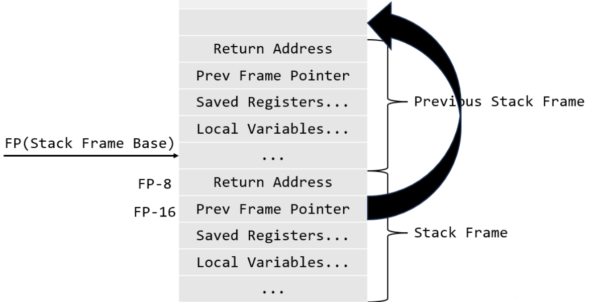

# 1.RISC-V assembly (难度：easy)

- **题目要求**

阅读***call.asm***中函数`g`、`f`和`main`的代码。RISC-V的使用手册在[参考页](https://pdos.csail.mit.edu/6.828/2020/reference.html)上。以下是您应该回答的一些问题（将答案存储在***answers-traps.txt***文件中）：

1. 哪些寄存器保存函数的参数？例如，在`main`对`printf`的调用中，哪个寄存器保存13？
2. `main`的汇编代码中对函数`f`的调用在哪里？对`g`的调用在哪里(提示：编译器可能会将函数内联）
3. `printf`函数位于哪个地址？
4. 在`main`中`printf`的`jalr`之后的寄存器`ra`中有什么值？
5. 运行以下代码。

```c++
unsigned int i = 0x00646c72;
printf("H%x Wo%s", 57616, &i);
```


程序的输出是什么？这是将字节映射到字符的[ASCII码表](http://web.cs.mun.ca/~michael/c/ascii-table.html)。

输出取决于RISC-V小端存储的事实。如果RISC-V是大端存储，为了得到相同的输出，你会把`i`设置成什么？是否需要将`57616`更改为其他值？

[这里有一个小端和大端存储的描述](http://www.webopedia.com/TERM/b/big_endian.html)和一个[更异想天开的描述](http://www.networksorcery.com/enp/ien/ien137.txt)。

1. 在下面的代码中，“`y=`”之后将打印什么(注：答案不是一个特定的值）？为什么会发生这种情况？

```c++
printf("x=%d y=%d", 3);
```


- **解题步骤**

```assembly
void main(void) {
  1c:	1141                	addi	sp,sp,-16
  1e:	e406                	sd	ra,8(sp)
  20:	e022                	sd	s0,0(sp)
  22:	0800                	addi	s0,sp,16
  printf("%d %d\n", f(8)+1, 13);
  24:	4635                	li	a2,13
  26:	45b1                	li	a1,12
  28:	00000517          	auipc	a0,0x0
  2c:	7a850513          	addi	a0,a0,1960 # 7d0 <malloc+0xea>
  30:	00000097          	auipc	ra,0x0
  34:	5f8080e7          	jalr	1528(ra) # 628 <printf>
  exit(0);
  38:	4501                	li	a0,0
  3a:	00000097          	auipc	ra,0x0
  3e:	276080e7          	jalr	630(ra) # 2b0 <exit>
```

**第一问**

在`printf`下面的汇编代码中可以看到`li	a2,13`，`li	a1,12`，所以a系列的寄存器保存参数，这里是a1~a7。参数13保存在a2寄存器中


**第二问**

 26:	45b1                	li	a1,12

这里`f(8)+1`直接就计算为了12，说明编译器将函数内联直接获得了结果。`main`函数在这里调用了f，f调用g


**第三问**

  34:	5f8080e7          	jalr	1528(ra) # 628 <printf>

`jalr`跳转到`printf`函数执行的位置，也就是注释中的`0x628`


**第四问**

这里用到了汇编指令`auipc`，这个指令是将后面的参数`0x0`和pc的相加赋值给`ra`寄存器。就是`0x0`+`0x30`，结果`0x30`


**第五问**

`%x`打印十六进制数，将`57616`转换为十六进制`0xE110`

`%s`打印字符串，`0x00646c72`在计算机中小端存储，也就是`72-6c-64-00`，对应`ASCII`中的`r-l-d-0`，0作为字符串的结束标识

结果为：HE110 World

如果是大端存储，`i`则为`0x726c6400`


**第六问**

由于第二个参数并没有给出，printf会直接打印打印之前a2寄存器中的值


# 2.Backtrace(难度：moderate)

- **题目要求**

```c++
backtrace:
0x0000000080002cda
0x0000000080002bb6
0x0000000080002898
```

也就实现打印曾经调用函数地址


- **解题步骤**

- 首先我们了解一下栈帧

栈帧是栈中的一个特定区域，用来保存函数调用的上下文信息，包括：

1. 返回地址：函数执行完毕后应该返回到的地址。
2. 函数参数：传递给函数的参数值。
3. 局部变量：函数内部定义的局部变量。
4. 保存的寄存器：如果函数修改了一些寄存器的值，需要在调用前保存这些寄存器的原始值，以便函数返回时恢复。
5. 链式指针：有些调用约定中，栈帧还会包含一个指向调用函数的栈帧的指针，以维护调用链。

每当程序调用一个新函数时，系统会在栈上为这个函数分配一个新的栈帧，栈帧的大小和内容取决于函数的局部变量、参数数量以及需要保存的寄存器等信息


- 其次我们需要我们了解`xv6`函数调用栈的组成



可以看这个[参考blog](https://blog.csdn.net/zzy980511/article/details/131069746)，我在这里也讲一下：

当我们在获得Frame Pointer时，这个寄存器其实指向的是上一级函数栈帧的最后一个位置。那么FP-8一定存放的是上一级函数的返回地址ra，FP-16这个地址一定存放的是上一级栈帧指针Previous FP，这样我们就可以循环或者递归获得之前函数的栈帧位置，从而获得Return Address

代码：

```c++
void
backtrace(void) {
  printf("backtrace:\n");
  // 读取当前栈指针
  uint64 fp = r_fp();
  // 获得当前栈的基地址
  uint64 base = PGROUNDDOWN(fp);
  while (PGROUNDDOWN(fp) == base) {
    printf("%p\n", *(uint64*)(fp - 8));
    // Prev.Frame(fp)
    fp = *(uint64*)(fp - 16);
  }
}
```

`xv6`每一个个栈分配了一个页面的大小，这是我们判断是否越界的条件


# 3.Alarm(难度：Hard)

- **题目要求**

你应当添加一个新的`sigalarm(interval, handler)`系统调用，如果一个程序调用了`sigalarm(n, fn)`，那么每当程序消耗了CPU时间达到n个“滴答”，内核应当使应用程序函数`fn`被调用。当`fn`返回时，应用应当在它离开的地方恢复执行。在XV6中，一个滴答是一段相当任意的时间单元，取决于硬件计时器生成中断的频率。如果一个程序调用了`sigalarm(0, 0)`，系统应当停止生成周期性的报警调用。


- **解题步骤**

- 添加两个新的系统调用，和lab2类似
- 给进程添加新的变量

```c++
// kernel/proc.h
struct proc {
  // ...
  int flag;  // 是否处于alarm状态
  int nticks;  // alarm要求的时间间隔
  uint time;  //　程序运行的时间
  uint64 addr;  // alarm要求调用的函数
  struct trapframe alarmframe;  // 保存alarm前的现场
};
```


- 编写`sigalarm`系统调用

这个系统调用的需要两个参数，一个是滴答数，一个是函数地址。在程序运行对应的滴答就会去对应的函数地址执行

比较难想的就是**为什么到了指定的滴答数就会执行另外一个函数**，这里要看`/kernel/trap.c`文件中的`usertrap()`函数，里面有一个**时钟中断，每隔一个`tick`就会中断一次**。我们可以借助这个去进行计数，每次陷入内核处理时钟中断时判断程序运行了多少`tick`，从而采取相应的手段

```c++
uint64
sys_sigalarm(void){
  // 传递alarm参数给进程，方便之后的中断
  int nticks;
  uint64 addr;
  struct proc *p = myproc();

  p->flag = 1;

  if (argint(0, &nticks) < 0)
    return -1;
  if (argaddr(1, &addr) < 0)
    return -1;
  if (nticks == 0) 
    p->flag = 0;
  else {
    p->nticks = nticks;
    p->addr = addr;
  }
  return 0;
}
```

我们之前添加在`struct proc`里面的`flag`很重要，他决定了我们这个进程的`sigalarm`系统调用是否有效；有效调用这个系统调用时，我们将`flag`设置为1，方便时钟中断代码的改写。如果参数为0,0表明关闭这个系统调用，我们将`flag`设置为0。

```c++
// kernel/trap.c
void usertrap(void)
{
  // ...
  if (p->killed)
    exit(-1);

  // 中断源是计时器中断
  if (which_dev == 2)
  {
    // sigalarm生效中
    if (p->flag == 1)
    {
      p->time += 1;
      if (p->time == p->nticks)
      {
        memmove(&p->alarmframe, p->trapframe, sizeof(struct trapframe));
        p->trapframe->epc = p->addr;
      }
    }
    yield();
  }
  // 返回用户态
  usertrapret();
}
```


- 编写`sigreturn`系统调用

恢复现场，只需将`time`参数置零即可，方便之后的计数

```c++
uint64
sys_sigreturn(void) {
  struct proc *p = myproc();
  memmove(p->trapframe, &p->alarmframe, sizeof(struct trapframe));
  p->time = 0;
  return 0;
}
```

