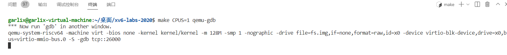
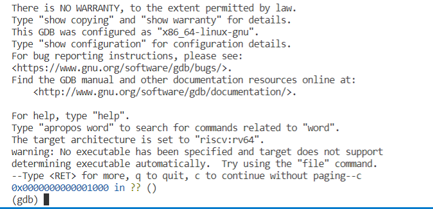
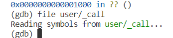
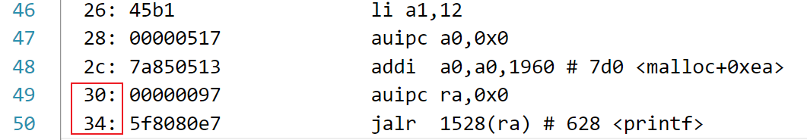
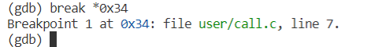
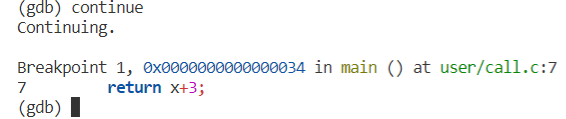
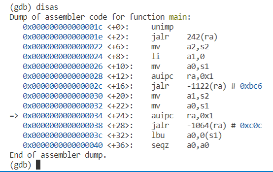
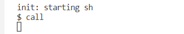
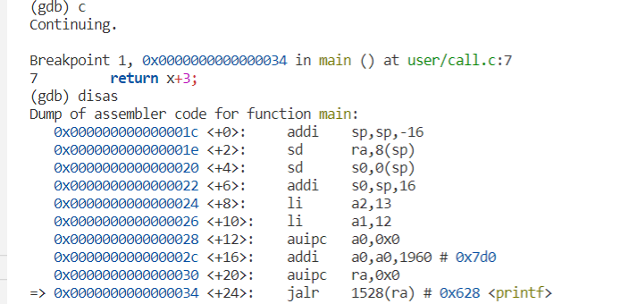
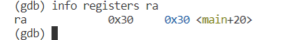

# 1.开启`gdb`调试

**启动第一个终端**

输入：`make CPUS=1 qemu-gdb`

**启动第二个终端**

输入：`gdb-multiarch`

# 2.调试步骤

- **加载想要调试的文件，这里以`user/call.c`为例，我们用调试的方法去获得`lab4`中第一题中`ra`寄存器的值**

​		**输入 `file user/_文件名`**

- **设置断点**

  **输入`c *虚拟地址`**

这里可以看到`ra`的值在`0x3f`的位置被设置，所以我们要在`0x34`的位置设置断点

- **启动程序**

​		**输入`c`或`continue`**

这里可以看到程序运行后遇到了一个断点，这是因为`PC`到达了虚拟地址为`0x34`位置，我们需要检查当前附近的汇编代码，因为这不一定是我们要求的文件内对应的虚拟地址，可能是`qemu`在运行启动代码时`PC`等于`0x34`

- **检查汇编代码**

​		**输入`disas`**

这与我们需要的汇编代码不一致，那就可以输入`c`让程序继续执行

- **查看寄存器信息**

程序正常启动后会一直`continue`等待输入，我们在第一个终端中输入`call`

这是又发生了中断，我们检查汇编代码，发现完全一致，那么下一步就可以查看寄存器的值

输入`info registers ra`得到`ra`寄存器的值

